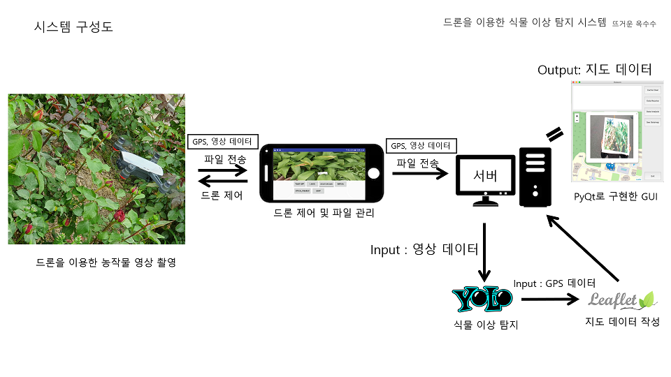
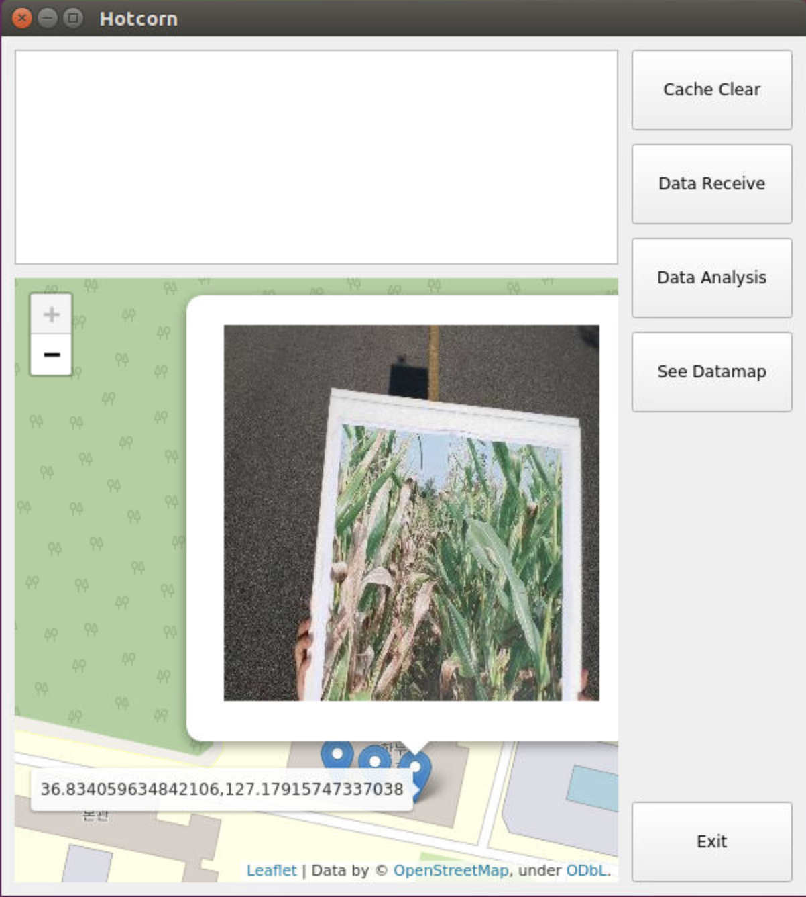

# Hotcorn  
Deep-Learning-Powered Agriculture Drone for Plant Disease Detection  


이 프로젝트는 2019년도 상명대학교 컴퓨터공학과 캡스톤디자인 결과물 프로젝트 입니다.  
상명대학교 컴퓨터공학과 이영훈, 최남기, 이정민 세 명이 제작했습니다.

드론을 이용해 밭을 촬영한 뒤, 촬영한 영상을 분석하여 식물의 이상(질병, 영양이상 등)을 탐지하는 프로젝트입니다.  
프로그램은 드론 제어 어플리케이션과 영상 분석 프로그램의 두 부분으로 나뉘어져 있습니다.

각 부분의 자세한 설명은 프로젝트 참가인원의 블로그를 참조해 주세요.  
> 이영훈 https://dudgns7675.tistory.com/  
> 최남기 https://namki-learning.tistory.com/  
> 이정민 https://jeongmin-lee.tistory.com/

# Demonstrate  
[](https://www.youtube.com/watch?v=xmiLOTW-y_8)  
이미지를 클릭하면 프로젝트 시연 동영상으로 이동합니다.

# Requirement  
* 본 프로그램은 make 명령어를 이용해 컴파일하기 때문에 Linux, MacOS 환경에서 정상작동 합니다.  
  Windows 환경에서 사용하기 위해서는 프로그램 실행 전에 따로 컴파일을 해주어야 합니다.  
  
* 본 프로그램은 드론 제어 어플리케이션과 영상 분석 프로그램 두 부분으로 나뉘어져 있습니다.  
  해당 Github는 영상 분석 프로그램에 해당하며, 드론 제어 어플리케이션은 어플리케이션 제작을 담당한  
  최남기 학우의 Github(아래 링크)에서 확인할 수 있습니다.  
  > https://github.com/choinamki/plant_anomaly_detection_dji_spark_drone  
  
* 코드를 사용하기 위해서는 모델 파일이 필요합니다.  
  저희 프로젝트에서 기 학습시킨 모델 파일은 아래 주소에서 다운로드 받으실 수 있습니다.  
  > http://bit.ly/39pNWkx  
  
  파일의 기본 경로는 codes/darknet/backup_corn/yolov3_34000.weights 입니다.  
  경로 수정이 필요할 경우 codes/guiexe.py 코드의 darknet 클래스에서 변경 가능합니다.
  
* 필요한 패키지는 requirements.txt 파일에 명시되어 있습니다.  

# Quick Start  
* 모델파일이 준비되었다면 아래 명령어로 프로그램을 시작할 수 있습니다.  
```
pip install -r requirements.txt  
python ./codes/PUBG_Prediction.py
```

* 아래 이미지와 같이 동작합니다.  
    
  분석결과를 표시하면 이상이 탐지된 위치에 마커가 표시됩니다.  
  마커에 마우스를 올리면 이상이 탐지된 GPS 좌표가, 클릭하면 탐지된 이미지를 표시합니다.  
  
# 메뉴 설명  
* Cache Clear : 드론으로부터 전송받은 동영상, 데이터 학습을 위해 전처리된 파일 등 임시파일을 모두 삭제합니다.  
* Data Receive : 드론으로부터 영상 데이터를 전송받습니다.  
* Data Analysis : 드론으로부터 전송받은 영상 데이터를 분석합니다.  
* See Datamap : 분석 완료된 데이터를 열람합니다.  
  
# 참고사항  
* 코드는 Python 3.5 버전을 기준으로 작성되었습니다.  
  
* 각 코드 설명  
```
guiexe.py : Main 코드(GUI실행)입니다. darknet 실행 관련 클래스도 포함되어 있습니다.  
maps.py : 지도 데이터 생성용 클래스입니다.  
server.py : 소켓통신 관련 함수입니다.  
vfs.py : 영상 전처리용 함수입니다.
```  
